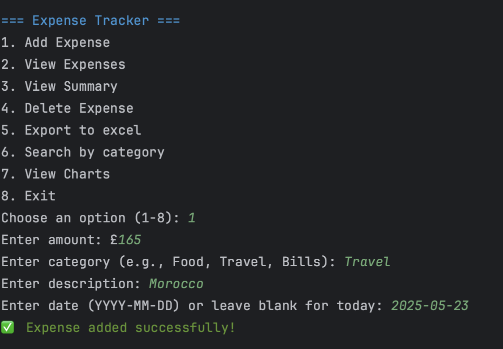
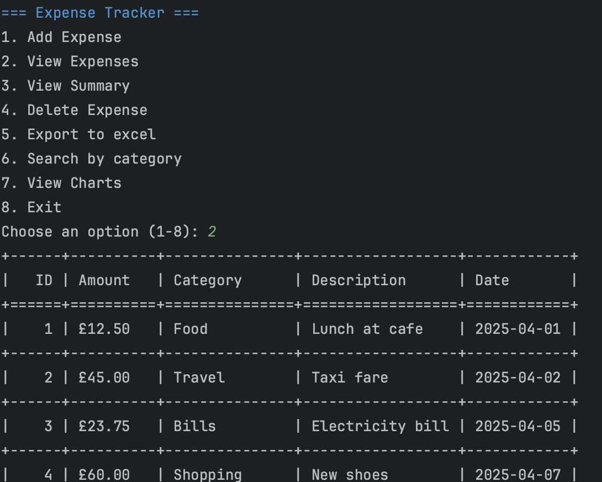
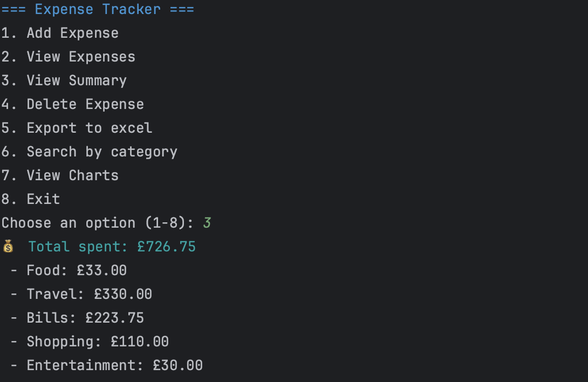
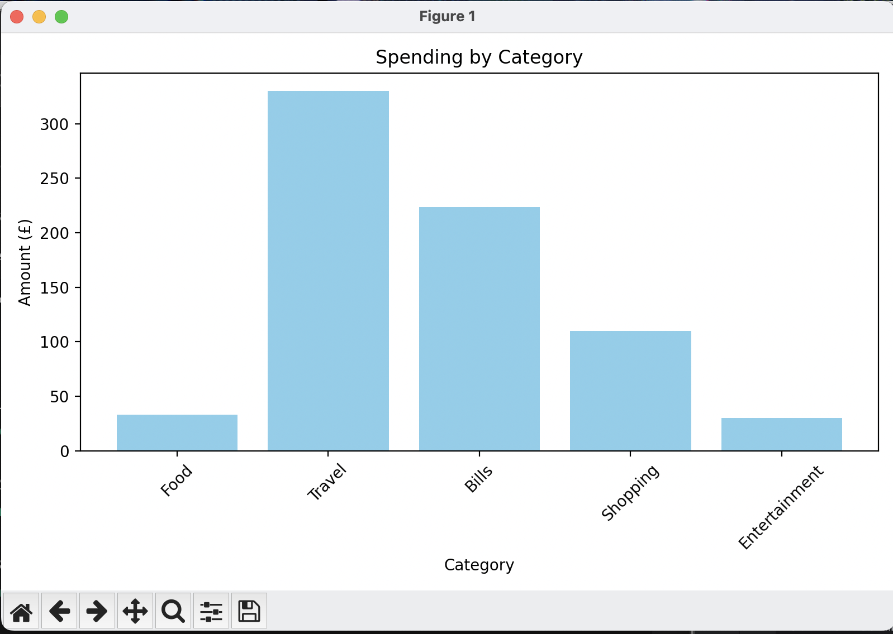
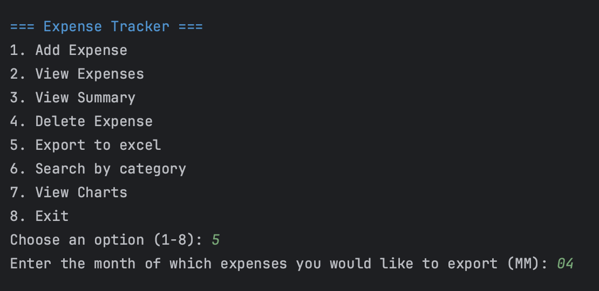
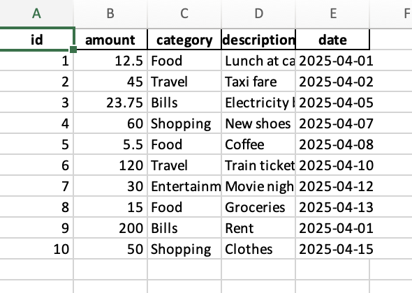

# ExpenseTracker

A simple **Python-based expense tracker** that allows users to log, view, delete, and analyze their expenses. Includes Excel export and visual charts.

## Features
- Add expenses with amount, category, description, and date.
- View all expenses in a neat table.
- View summary of total spending and spending per category.
- Delete specific expenses by ID.
- Export expenses for a given month to Excel.
- Search expenses by category.
- Visualize spending using bar charts (by category).

## Technologies Used
- Python 3.x
- JSON for data storage
- pandas for Excel export
- matplotlib for charts
- tabulate and colorama for console formatting

## Installation
1. Clone the repository:
```bash
git clone https://github.com/Naan3/ExpenseTracker.git
```
2. Install required packages
```bash
pip install pandas matplotlib tabulate colorama
```
3. Run the program

## 📸 Screenshots  

### 1. Adding & Viewing Expenses
### Adding Expense

### Viewing Expense
<p align="center">
  
  
</p>

### 2. Expense Summary  
  

### 3. Spending Visualization  
  

### 4. Excel Export  
 
### Viewing Table In Excel

